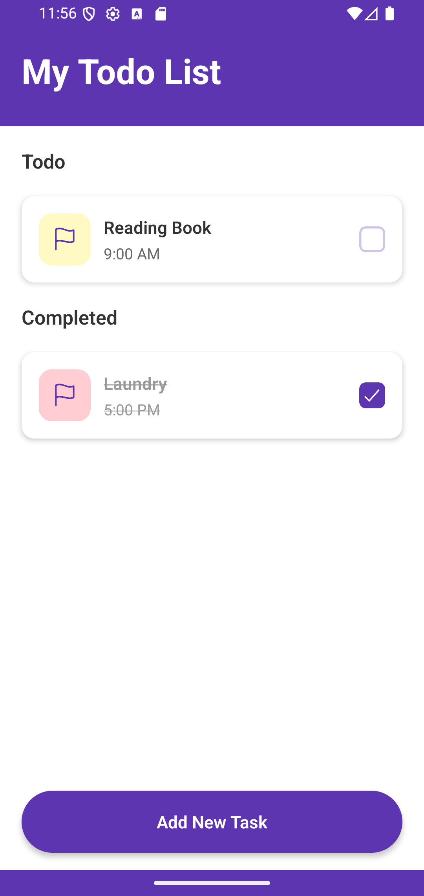
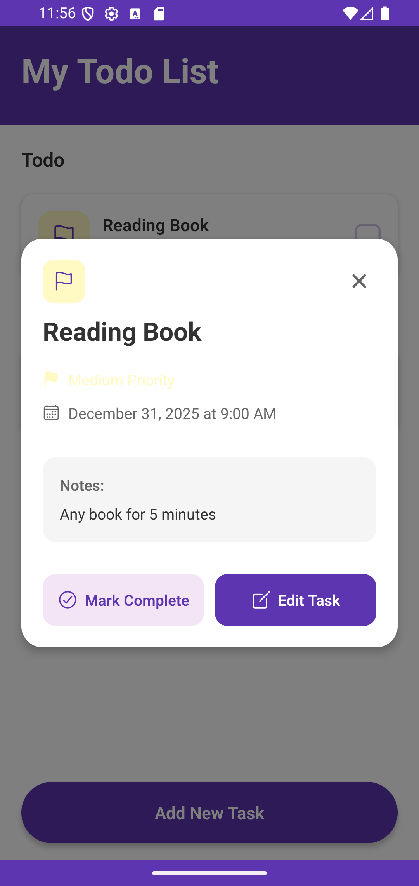
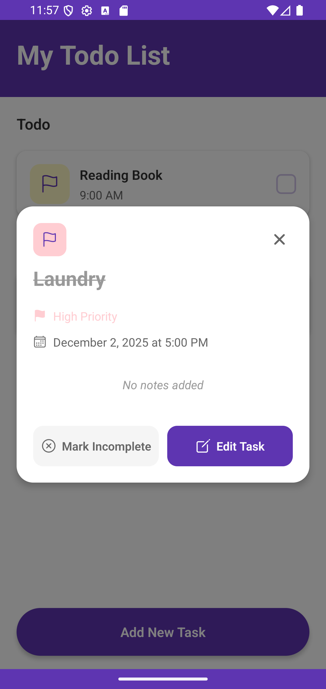
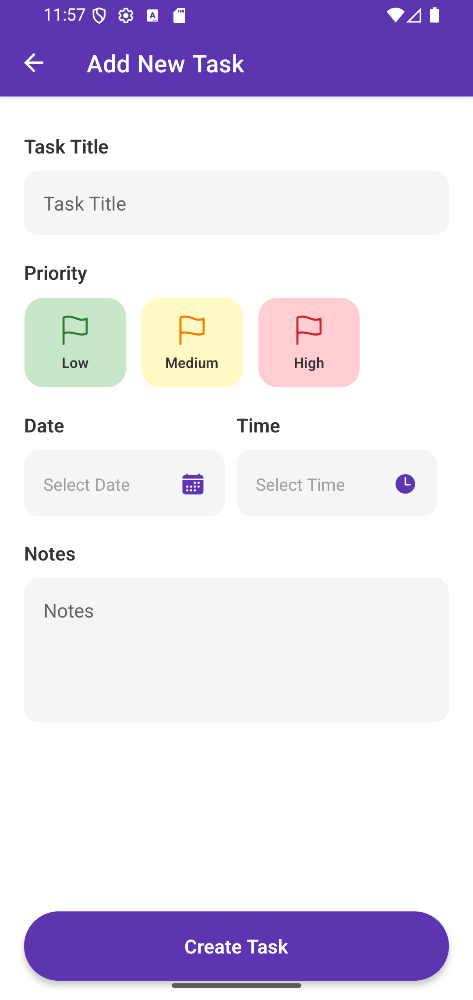
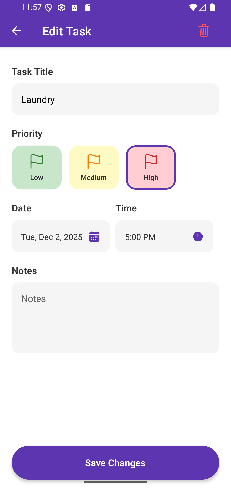
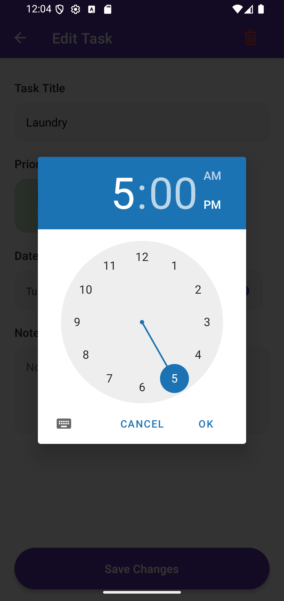

# Todo App

A simple Todo application built with React Native and Expo for managing daily tasks.

## Technology

- **React Native**: 0.81.5
- **Expo**: ~54.0.25
- **React**: 19.1.0
- **TypeScript**: ~5.9.2

## Project Description

A Todo application that allows users to:
- Create, edit, and delete tasks
- Set task priorities (Low, Medium, High)
- Set date and time deadlines
- Add notes for each task
- Store data locally using AsyncStorage

## Dependencies & Usage

### Navigation
- **@react-navigation/native** & **@react-navigation/native-stack**: For navigation between screens (TodoList and TaskForm)
- **react-native-safe-area-context**: Handles safe area for various devices
- **react-native-screens**: Performance optimization for screen navigation

### Form Handling & Validation
- **formik**: Manages form state and submit handling
- **yup**: Validation schema for form input

### Storage
- **@react-native-async-storage/async-storage**: Stores task data locally on device

### UI Components
- **@expo/vector-icons**: Icon library (Ionicons)
- **@react-native-community/datetimepicker**: Date and time picker for selecting deadlines
- **expo-status-bar**: Custom status bar styling

## How to Run

```bash
# Install dependencies
npm install

# Start development server
npm start

# Run on Android
npm run android

# Run on iOS
npm run ios

# Run on Web
npm run web
```

## Preview Android

<div align="center">









</div>

